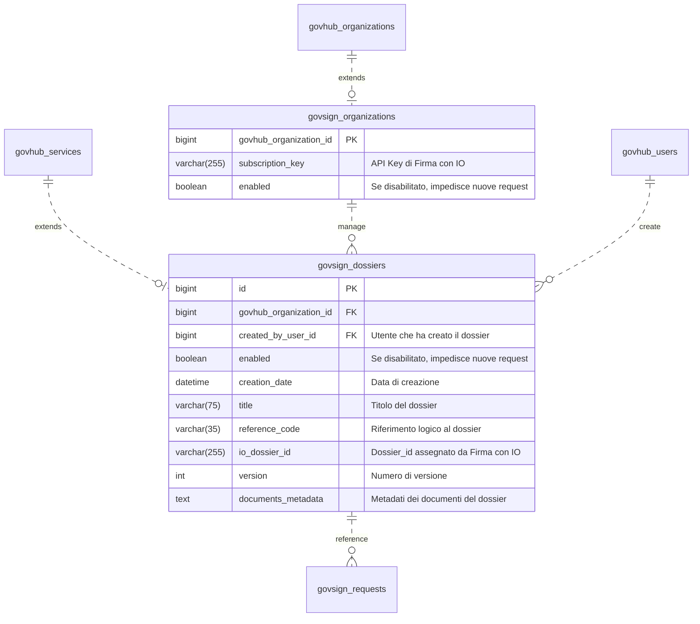

# Dossier

```mermaid fullWidth="true"
erDiagram

govhub_organizations ||..o| govsign_organizations: "extends"
govhub_services ||..o| govsign_dossiers: "extends"
govsign_organizations ||..o{ govsign_dossiers: "manage"
govsign_dossiers ||..o{ govsign_requests: "reference"
govhub_users ||..o{ govsign_dossiers: "create"


govsign_organizations {
    bigint govhub_organization_id PK
    varchar(255) subscription_key "API Key di Firma con IO"
    boolean enabled "Se disabilitato, impedisce nuove request"
}

govsign_dossiers {
    bigint id PK
    bigint govhub_organization_id FK
    bigint created_by_user_id FK "Utente che ha creato il dossier"
    boolean enabled "Se disabilitato, impedisce nuove request"
    datetime creation_date "Data di creazione"
    varchar(75) title "Titolo del dossier" 
    varchar(35) reference_code "Riferimento logico al dossier" 
    varchar(255) io_dossier_id "Dossier_id assegnato da Firma con IO"
    int version "Numero di versione" 
    text documents_metadata "Metadati dei documenti del dossier"
}


```
