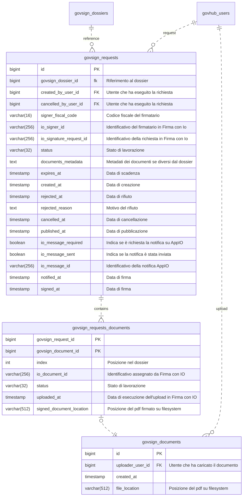

# Richieste di firma

```mermaid
erDiagram

govsign_dossiers ||..o{ govsign_requests: "reference"
govsign_requests ||..|{ govsign_requests_documents: "contains"
govhub_users ||..o{ govsign_requests: "request"
govsign_requests_documents |o..|| govsign_documents: ""
govhub_users ||..o{ govsign_documents: "upload"

govsign_requests {
    bigint id PK
    bigint govsign_dossier_id fk "Riferimento al dossier"
    bigint created_by_user_id FK "Utente che ha eseguito la richiesta"
    bigint cancelled_by_user_id FK "Utente che ha eseguito la richiesta"
    varchar(16) signer_fiscal_code "Codice fiscale del firmatario"
    varchar(256) io_signer_id "Identificativo del firmatario in Firma con Io"
    varchar(256) io_signature_request_id "Identificativo della richiesta in Firma con Io"
    varchar(32) status "Stato di lavorazione"
    text documents_metadata "Metadati dei documenti se diversi dal dossier"
    timestamp expires_at "Data di scadenza"
    timestamp created_at "Data di creazione"
    timestamp rejected_at "Data di rifiuto"
    text rejected_reason "Motivo del rifiuto"
    timestamp cancelled_at "Data di cancellazione"
    timestamp published_at "Data di pubblicazione"
    boolean io_message_required "Indica se è richiesta la notifica su AppIO"
    boolean io_message_sent "Indica se la notifica è stata inviata"
    varchar(256) io_message_id "Identificativo della notifica AppIO"
    timestamp notified_at "Data di firma"
    timestamp signed_at "Data di firma"
}

govsign_requests_documents {
    bigint govsign_request_id PK
    bigint govsign_document_id PK
    int index "Posizione nel dossier" 
    varchar(256) io_document_id "Identificativo assegnato da Firma con IO"
    varchar(32) status "Stato di lavorazione"
    timestamp uploaded_at "Data di esecuzione dell'upload in Firma con IO"
    varchar(512) signed_document_location "Posizione del pdf firmato su filesystem"
}

govsign_documents {
    bigint id PK
    bigint uploader_user_id FK "Utente che ha caricato il documento"
    timestamp created_at
    varchar(512) file_location "Posizione del pdf su filesystem"
}

```
